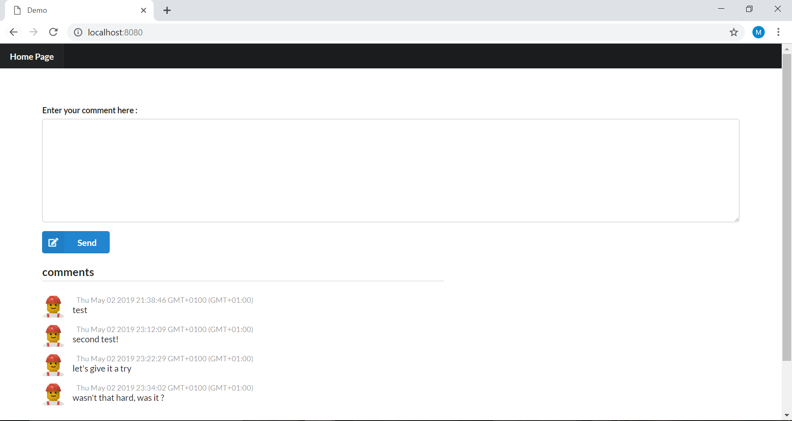
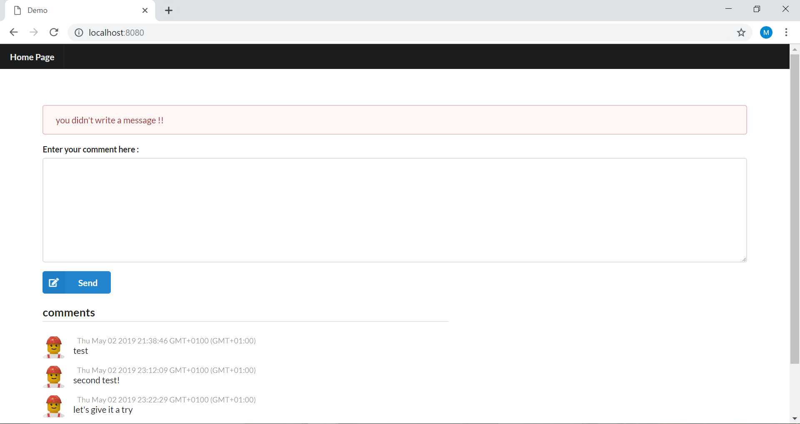
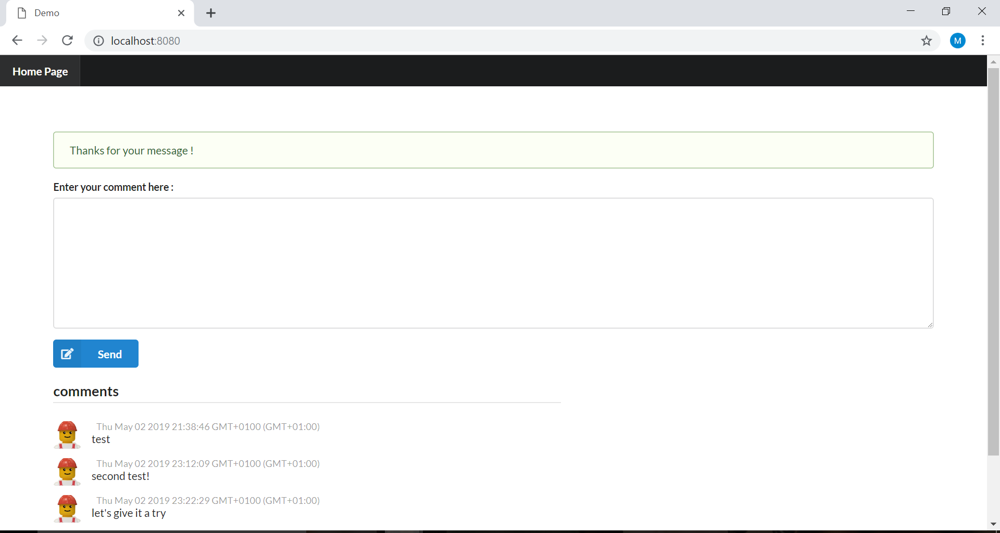
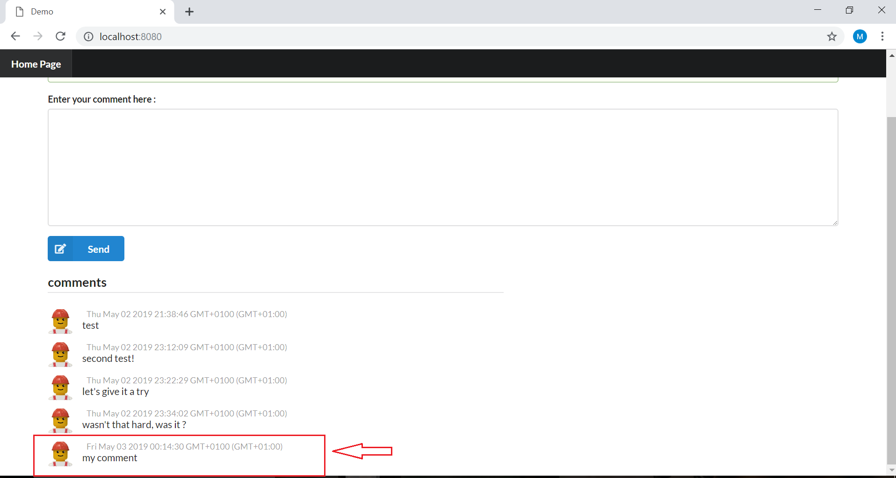
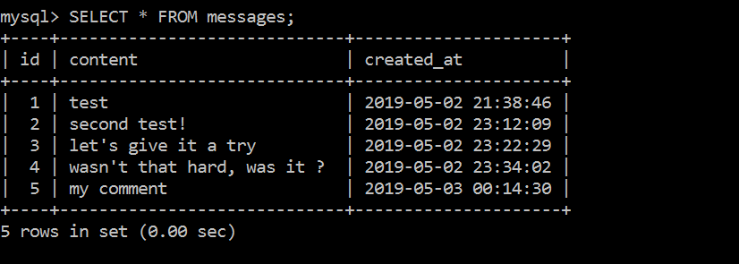

## introduction
This project is a simple web app built using Node.js ( mainly express.js). I did it to gain some hands on experience with the framework. despites its simplicity, it covers a lot of points : 
* giving a dynamic interface, 
* heavy use of npm and many external libraries and packages 
* using MySQL data base ...

## how it looks 
Here is the main (and only) page of our app :

you have where to enter a comment there, if you write something and hit the button "Send", the next "thanks" message will be shown : 

and you can see your message added immediately to the list of comments, with the exact time you submitted it. 

but if you click the Send button without writing anything, you will have the following message error 

and if you click on "home page" on the menu bar, you will see the main screen again and the message will be gone. 

of course, in order to have all the comments, we are storing them in a database, it is a MySQL database with simply 3 columns : id, content ( the comment you write), and created_at (the time of its submission)

